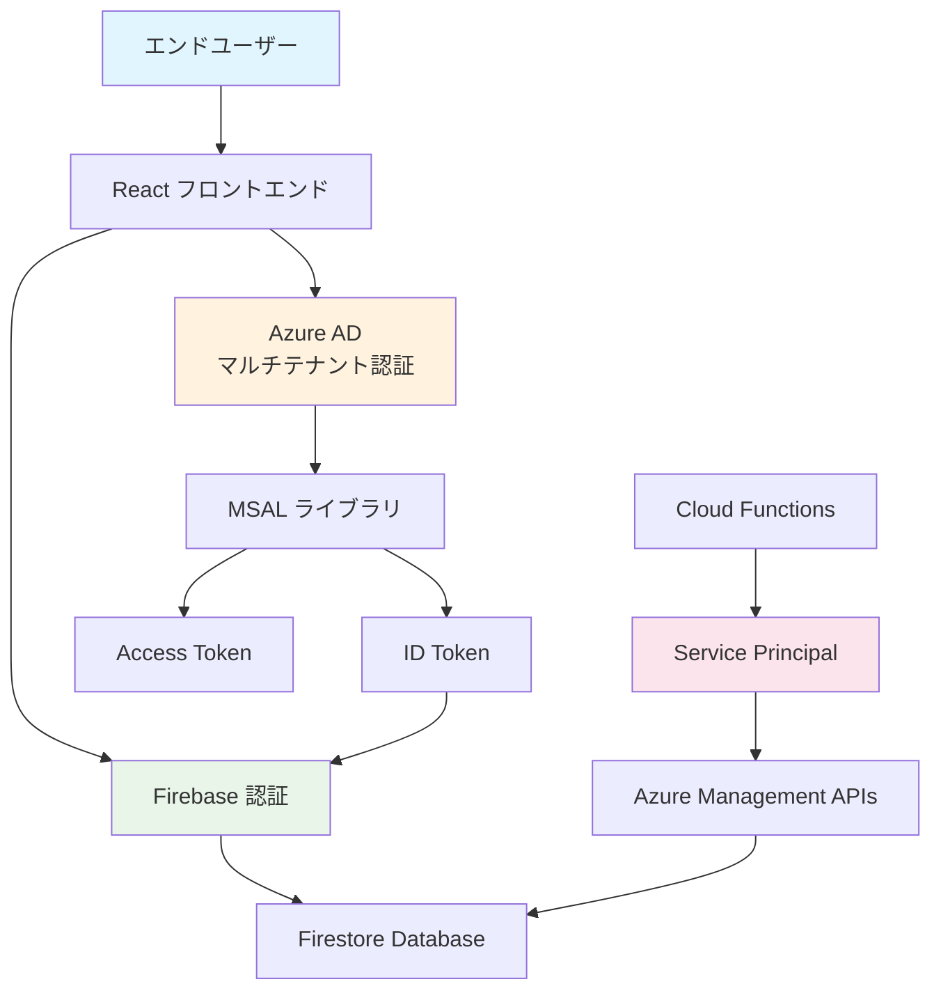

# 認証フロー詳細

Azure Data Collector の認証システムの詳細な仕組みと実装について説明します。

## 🔐 認証アーキテクチャ概要

### 二層認証システム

Azure Data Collector では、セキュリティと機能性を両立させるため、二層の認証システムを採用しています：



### 認証フローの種類

1. **フロントエンド認証**: ユーザー主導の認証フロー
2. **バックエンド認証**: Service Principal を使用した自動認証

## 👥 フロントエンド認証フロー

### MSAL設定

```typescript
// authConfig.ts
import { Configuration, PopupRequest } from '@azure/msal-browser';

export const msalConfig: Configuration = {
  auth: {
    clientId: "7a6d794f-1aff-48c4-926c-f96d757247b1",
    authority: "https://login.microsoftonline.com/common",
    redirectUri: window.location.origin,
    navigateToLoginRequestUrl: false,
  },
  cache: {
    cacheLocation: "sessionStorage",
    storeAuthStateInCookie: false,
  },
  system: {
    allowNativeBroker: false,
  }
};

export const loginRequest: PopupRequest = {
  scopes: [
    "User.Read",
    "Directory.Read.All", 
    "https://management.azure.com/user_impersonation"
  ],
  prompt: "select_account"
};
```

### 認証フロー実装詳細

#### 1. 初期ログイン

```typescript
// LoginPage.tsx での実装
const handleLogin = async () => {
  try {
    const loginResponse = await instance.loginPopup(loginRequest);
    
    // ID Token 取得
    const idToken = loginResponse.idToken;
    
    // Firebase カスタムトークン作成
    const customToken = await createFirebaseToken(idToken);
    
    // Firebase 認証
    await signInWithCustomToken(auth, customToken);
    
    // ユーザー情報保存
    await saveUserToFirestore(loginResponse.account);
    
  } catch (error) {
    console.error("Login failed:", error);
  }
};
```

#### 2. サイレント認証

```typescript
// useMSAL hook での実装
const acquireTokenSilently = async (scopes: string[]) => {
  const account = msalInstance.getActiveAccount();
  
  if (!account) {
    throw new Error("No active account");
  }
  
  const silentRequest = {
    scopes,
    account,
  };
  
  try {
    const response = await msalInstance.acquireTokenSilent(silentRequest);
    return response.accessToken;
  } catch (error) {
    // サイレント認証失敗時はポップアップ認証にフォールバック
    return await msalInstance.acquireTokenPopup(silentRequest);
  }
};
```

#### 3. テナント切り替え

```typescript
// TenantSwitcher.tsx での実装
const switchTenant = async (tenantId: string) => {
  const tenantRequest = {
    scopes: ["User.Read"],
    authority: `https://login.microsoftonline.com/${tenantId}`,
    account: msalInstance.getActiveAccount(),
  };
  
  try {
    const response = await msalInstance.acquireTokenSilent(tenantRequest);
    
    // 新しいテナントのトークンでFirebase再認証
    const customToken = await createFirebaseToken(response.idToken);
    await signInWithCustomToken(auth, customToken);
    
    // テナント情報をローカルストレージに保存
    localStorage.setItem('selectedTenant', tenantId);
    
  } catch (error) {
    console.error("Tenant switch failed:", error);
  }
};
```

### トークン管理

#### アクセストークンの取得と更新

```typescript
// useAccessToken.ts カスタムフック
export const useAccessToken = (scopes: string[]) => {
  const { instance, accounts } = useMsal();
  const [accessToken, setAccessToken] = useState<string | null>(null);
  const [loading, setLoading] = useState(false);
  
  const getToken = useCallback(async () => {
    if (!accounts[0]) return null;
    
    setLoading(true);
    try {
      const response = await instance.acquireTokenSilent({
        scopes,
        account: accounts[0],
      });
      
      setAccessToken(response.accessToken);
      return response.accessToken;
    } catch (error) {
      console.error("Token acquisition failed:", error);
      return null;
    } finally {
      setLoading(false);
    }
  }, [instance, accounts, scopes]);
  
  useEffect(() => {
    getToken();
  }, [getToken]);
  
  return { accessToken, loading, refreshToken: getToken };
};
```

#### トークンキャッシュ戦略

```typescript
// tokenCache.ts
interface TokenCacheEntry {
  token: string;
  expiresAt: number;
  scopes: string[];
}

class TokenCache {
  private cache = new Map<string, TokenCacheEntry>();
  
  set(key: string, token: string, expiresIn: number, scopes: string[]) {
    this.cache.set(key, {
      token,
      expiresAt: Date.now() + (expiresIn * 1000),
      scopes,
    });
  }
  
  get(key: string): string | null {
    const entry = this.cache.get(key);
    
    if (!entry || Date.now() >= entry.expiresAt) {
      this.cache.delete(key);
      return null;
    }
    
    return entry.token;
  }
  
  clear() {
    this.cache.clear();
  }
}

export const tokenCache = new TokenCache();
```

## 🔧 バックエンド認証フロー

### Service Principal 認証

```python
# backend/auth/azure_auth.py
from azure.identity import ClientSecretCredential
from azure.mgmt.resource import ResourceManagementClient
from azure.mgmt.consumption import ConsumptionManagementClient
import os

class AzureAuth:
    def __init__(self):
        self.credential = ClientSecretCredential(
            tenant_id=os.getenv("AZURE_TENANT_ID"),
            client_id=os.getenv("AZURE_CLIENT_ID"),
            client_secret=os.getenv("AZURE_CLIENT_SECRET")
        )
    
    def get_resource_client(self, subscription_id: str):
        return ResourceManagementClient(
            credential=self.credential,
            subscription_id=subscription_id
        )
    
    def get_consumption_client(self, subscription_id: str):
        return ConsumptionManagementClient(
            credential=self.credential,
            subscription_id=subscription_id
        )
    
    async def get_access_token(self, scope: str):
        token = await self.credential.get_token(scope)
        return token.token
```

### マルチテナント対応

```python
# backend/auth/multi_tenant_auth.py
from typing import Dict, List
from azure.identity import ClientSecretCredential

class MultiTenantAuth:
    def __init__(self):
        self.credentials: Dict[str, ClientSecretCredential] = {}
    
    def add_tenant(self, tenant_id: str, client_id: str, client_secret: str):
        self.credentials[tenant_id] = ClientSecretCredential(
            tenant_id=tenant_id,
            client_id=client_id,
            client_secret=client_secret
        )
    
    def get_credential(self, tenant_id: str) -> ClientSecretCredential:
        if tenant_id not in self.credentials:
            raise ValueError(f"No credentials found for tenant: {tenant_id}")
        return self.credentials[tenant_id]
    
    async def collect_data_for_tenant(self, tenant_id: str, subscription_id: str):
        credential = self.get_credential(tenant_id)
        
        # Azure Management API クライアント作成
        resource_client = ResourceManagementClient(
            credential=credential,
            subscription_id=subscription_id
        )
        
        # データ収集
        resources = list(resource_client.resources.list())
        
        return {
            "tenant_id": tenant_id,
            "subscription_id": subscription_id,
            "resources": [self._serialize_resource(r) for r in resources],
            "collected_at": datetime.utcnow().isoformat()
        }
```

## 🔗 Firebase 統合認証

### カスタムトークン生成

```python
# backend/auth/firebase_auth.py
import firebase_admin
from firebase_admin import auth, credentials
import jwt
import os

class FirebaseAuth:
    def __init__(self):
        if not firebase_admin._apps:
            cred = credentials.Certificate(
                os.getenv("GOOGLE_APPLICATION_CREDENTIALS")
            )
            firebase_admin.initialize_app(cred)
    
    def verify_azure_token(self, azure_id_token: str) -> dict:
        # Azure AD ID トークンの検証
        try:
            # JWT デコード（検証なし - 開発環境用）
            decoded = jwt.decode(
                azure_id_token, 
                options={"verify_signature": False}
            )
            return decoded
        except Exception as e:
            raise ValueError(f"Invalid Azure token: {e}")
    
    def create_custom_token(self, azure_claims: dict) -> str:
        # Azure AD のクレームから Firebase カスタムトークンを生成
        uid = azure_claims.get("oid")  # Azure AD Object ID
        
        additional_claims = {
            "azure_tenant_id": azure_claims.get("tid"),
            "azure_upn": azure_claims.get("upn"),
            "azure_roles": azure_claims.get("roles", []),
        }
        
        custom_token = auth.create_custom_token(uid, additional_claims)
        return custom_token.decode('utf-8')
    
    def verify_firebase_token(self, firebase_token: str) -> dict:
        # Firebase ID トークンの検証
        try:
            decoded_token = auth.verify_id_token(firebase_token)
            return decoded_token
        except Exception as e:
            raise ValueError(f"Invalid Firebase token: {e}")
```

### Firestore セキュリティルール

```javascript
// firestore.rules
rules_version = '2';
service cloud.firestore {
  match /databases/{database}/documents {
    // ユーザーは自分のデータのみアクセス可能
    match /users/{userId} {
      allow read, write: if request.auth != null 
        && request.auth.uid == userId;
      
      // テナント情報への読み取り専用アクセス
      match /tenants/{tenantId} {
        allow read: if request.auth != null 
          && request.auth.uid == userId;
        allow write: if request.auth != null 
          && request.auth.uid == userId
          && request.auth.token.azure_tenant_id == tenantId;
      }
    }
    
    // 共有データへの読み取り専用アクセス
    match /shared/{document=**} {
      allow read: if request.auth != null;
    }
  }
}
```

## 🔄 認証フロー実装例

### React コンポーネントでの認証

```typescript
// components/AuthGuard.tsx
import React from 'react';
import { useMsal } from '@azure/msal-react';
import { useAuthState } from 'react-firebase-hooks/auth';
import { auth } from '../config/firebase';

interface AuthGuardProps {
  children: React.ReactNode;
}

export const AuthGuard: React.FC<AuthGuardProps> = ({ children }) => {
  const { accounts } = useMsal();
  const [firebaseUser, loading] = useAuthState(auth);
  
  // Azure AD 認証確認
  const isAzureAuthenticated = accounts.length > 0;
  
  // Firebase 認証確認
  const isFirebaseAuthenticated = !!firebaseUser;
  
  if (loading) {
    return <div>認証状態を確認中...</div>;
  }
  
  if (!isAzureAuthenticated || !isFirebaseAuthenticated) {
    return <LoginPage />;
  }
  
  return <>{children}</>;
};
```

### Cloud Functions での認証

```python
# backend/functions/auth_middleware.py
from functools import wraps
from firebase_admin import auth
from flask import request, jsonify

def require_auth(f):
    @wraps(f)
    def decorated_function(*args, **kwargs):
        # Authorization ヘッダーからトークンを取得
        auth_header = request.headers.get('Authorization')
        
        if not auth_header or not auth_header.startswith('Bearer '):
            return jsonify({'error': 'Missing or invalid authorization header'}), 401
        
        token = auth_header.split(' ')[1]
        
        try:
            # Firebase トークン検証
            decoded_token = auth.verify_id_token(token)
            request.user = decoded_token
            return f(*args, **kwargs)
        except Exception as e:
            return jsonify({'error': f'Invalid token: {str(e)}'}), 401
    
    return decorated_function

# 使用例
@require_auth
def collect_azure_data(request):
    user = request.user
    azure_tenant_id = user.get('azure_tenant_id')
    
    # 認証されたユーザーのテナントからデータ収集
    data = collect_tenant_data(azure_tenant_id)
    return jsonify(data)
```

## 🛡️ セキュリティ考慮事項

### トークンセキュリティ

1. **アクセストークンの有効期限**: 1時間（Azure AD デフォルト）
2. **リフレッシュトークン**: 90日間有効
3. **ID トークン**: 1時間有効
4. **Firebase カスタムトークン**: 1時間有効

### 権限の最小化

```typescript
// 必要最小限のスコープのみ要求
const requiredScopes = [
  "User.Read",                    // ユーザー基本情報
  "Directory.Read.All",           // 組織情報（管理者同意必要）
  "https://management.azure.com/user_impersonation"  // Azure リソース
];

// オプションのスコープは別途要求
const optionalScopes = [
  "Calendars.Read",
  "Mail.Read"
];
```

### エラーハンドリング

```typescript
// authErrorHandler.ts
export const handleAuthError = (error: any) => {
  if (error.name === "InteractionRequiredAuthError") {
    // ユーザー操作が必要
    return "再ログインが必要です";
  }
  
  if (error.name === "BrowserAuthError") {
    // ブラウザ関連エラー
    return "ブラウザの設定を確認してください";
  }
  
  if (error.errorCode === "consent_required") {
    // 管理者同意が必要
    return "管理者による同意が必要です";
  }
  
  return "認証エラーが発生しました";
};
```

## 📚 参考資料

- [MSAL.js 公式ドキュメント](https://docs.microsoft.com/en-us/azure/active-directory/develop/msal-js-initializing-client-applications)
- [Azure AD Multi-tenant Apps](https://docs.microsoft.com/en-us/azure/active-directory/develop/howto-convert-app-to-be-multi-tenant)
- [Firebase Custom Tokens](https://firebase.google.com/docs/auth/admin/create-custom-tokens)
- [Microsoft Graph API](https://docs.microsoft.com/en-us/graph/overview)
